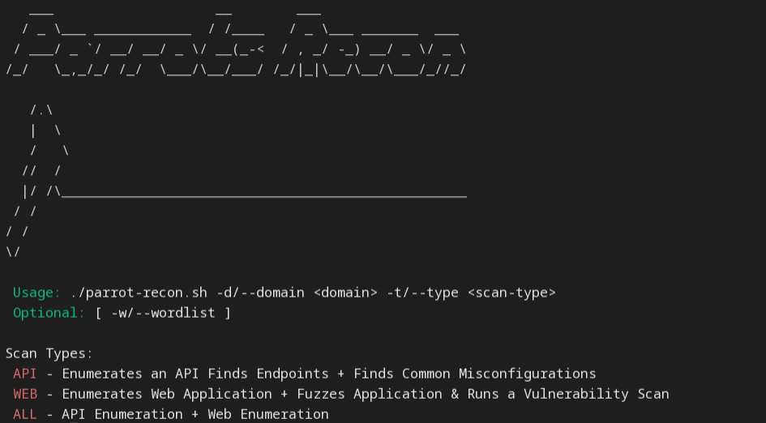

## Parrots Recon ( A Recon Automation Script Beta V1 )

install:
```
git clone https://github.com/parrotassassin15/parrot-recon.git
```

```
sudo chmod +x install-{platform}.sh ; sudo ./install-{platform}.sh
```

run: 
```
sudo ./parrot-recon.sh -d <domain> -t <scan type> -w <wordlist>
```

<br>

# Current Release Support
- Web Enumerataion 
- Vulnerability Scans 

# New Releases Coming Soon
- API Enumeration 
- Sends Email with Mailgun
- Opens Local Web Server for Results

<br>

Preview :

<br>


