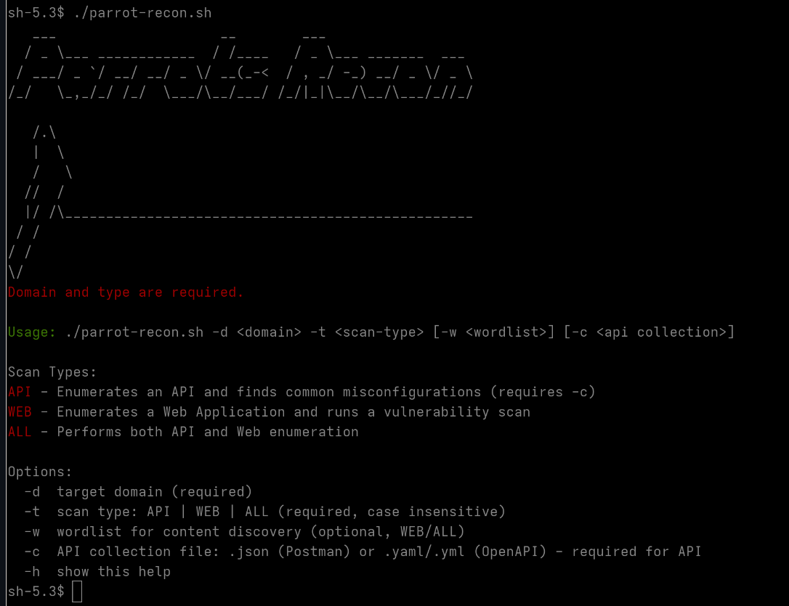

# Parrot Recon

A recon automation script that chains a stack of enumeration and vulnerability
scanners into a single run and drops everything into `results/`.

> **Warning**
> This tool is loud. It is built for bug bounties, not for engagements with a
> blue team watching. **Only point it at targets you are authorised to test.**
> The author is not responsible for what you do with it.



---

## Install

```bash
git clone https://github.com/parrotassassin15/parrot-recon.git
cd parrot-recon
sudo chmod +x install-archlinux.sh   # or install-debian.sh
sudo ./install-archlinux.sh
```

The installer pulls the package-manager tools, installs the Go helpers, clones
the bundled third-party tools into `tools/`, and builds `headi`.

## Usage

```bash
sudo ./parrot-recon.sh -d <domain> -t <scan-type> [-w <wordlist>] [-c <api-collection>]
```

Root is required — several scanners (nmap's service/script scans, cmsmap's data
files) will not run without it.

| Flag | Description |
|------|-------------|
| `-d` | Target domain. **Required.** |
| `-t` | Scan type: `API`, `WEB`, or `ALL`. Case insensitive. **Required.** |
| `-w` | Wordlist for content discovery. Optional, used by `WEB`/`ALL`. |
| `-c` | API collection file — Postman `.json` or OpenAPI `.yaml`/`.yml`. **Required for `API`.** |
| `-h` | Show help. |

### Scan types

**`WEB`** — website enumeration and vulnerability scanning:

- SQL error probe (`tools/main.go`)
- Search-engine dorking (`tools/dork.sh`)
- Nmap TCP service/script scan
- WAF / IDS / IPS detection (wafw00f)
- Subdomain enumeration (sublist3r)
- Nikto
- CMS enumeration (cmsmap)
- SSL/TLS scans — full, Heartbleed, ROBOT (sslyze)
- Nuclei template scan
- Security headers check (`tools/shcheck.py`)
- CORS misconfiguration scan (`tools/cors_scanner.py`)
- HTTP header injection (headi)
- Content discovery — only when `-w` is given (ffuf, falling back to dirsearch)

**`API`** — API enumeration from a collection file:

- Extracts absolute URLs from the Postman/OpenAPI collection
- Nmap `--script=vuln` against each unique host on 443
- Nikto against each unique host
- Unauthenticated-access check on every URL (flags any endpoint returning 200)

**`ALL`** — runs `API` then `WEB`. If `-c` is omitted, the API portion is
skipped with a warning and the web scan still runs.

### Examples

```bash
# web scan
sudo ./parrot-recon.sh -d example.com -t WEB

# web scan with content discovery
sudo ./parrot-recon.sh -d example.com -t WEB -w /usr/share/wordlists/dirb/common.txt

# API scan from a Postman collection
sudo ./parrot-recon.sh -d example.com -t API -c collections/example.postman.json

# everything
sudo ./parrot-recon.sh -d example.com -t ALL -c collections/example.postman.json -w wordlists/api-wordlist.txt
```

## Output

Everything lands in `results/`, named after the target:

```
results/
├── <domain>-tcp-scan.{nmap,gnmap,xml}   nmap
├── <domain>-dork.txt                    dork report
├── <domain>-dork-urls.txt               bare URL list from the dork
├── <domain>-sqlerror-probe.txt          SQL error probe
├── <domain>-sslyze-{regular,heartbleed,robot}.txt
├── <domain>-shcheck.txt                 security headers
├── <domain>-cors.csv                    CORS findings
├── <domain>-content-discovery.json      ffuf (only with -w)
├── <domain>-api-urls.txt                URLs pulled from the collection
├── <domain>-api-authcheck.txt           unauthenticated-access results
├── nikto-<domain>.txt
├── nikto-api-<host>.txt
├── nmap-api-vuln-<host>.{nmap,gnmap,xml}
├── nuclei-<domain>.txt
├── subdomains-<domain>.txt
├── wafw00f-<domain>.txt
├── cmsenum-<domain>.txt
└── headi-<domain>.txt
```

A run prints a summary of any skipped or failed steps at the end and exits
non-zero if anything failed, so it can be chained in CI.

## Behaviour notes

- **A missing tool skips its step**, it does not kill the run. The step is
  listed under "Skipped" in the closing summary.
- **A failing tool is reported, not hidden.** `Saved To:` is only printed when
  the step actually succeeded.
- **The scheme is resolved once** (https, falling back to http) and reused for
  every step, instead of running each tool twice and hoping one sticks.
- **The dork queries Mojeek and DuckDuckGo**, not Google — Google now serves
  lynx a JS wall and returns nothing. If an engine rate-limits the run, the
  script says so rather than silently reporting zero results. Raise the gap
  between queries with `DORK_DELAY=<seconds>`.

## Requirements / gotchas

- **nikto needs the `XML::Writer` perl module** or it refuses to start, even
  for plain-text output. The installers pull it in (`perl-xml-writer` on Arch,
  `libxml-writer-perl` on Debian).
- **cmsmap writes to its own data directory** under `site-packages` — it needs
  real root, which is why the script requires it.
- **`results/` must be writable.** After a `sudo` run the directory is owned by
  root; the script checks up front and tells you to fix the ownership rather
  than silently failing every write.
- Postman `{{baseUrl}}` template variables cannot be resolved and are filtered
  out of the extracted URL list.

## Roadmap

- Completion email via Mailgun
- Local web server / WebDAV for browsing results
